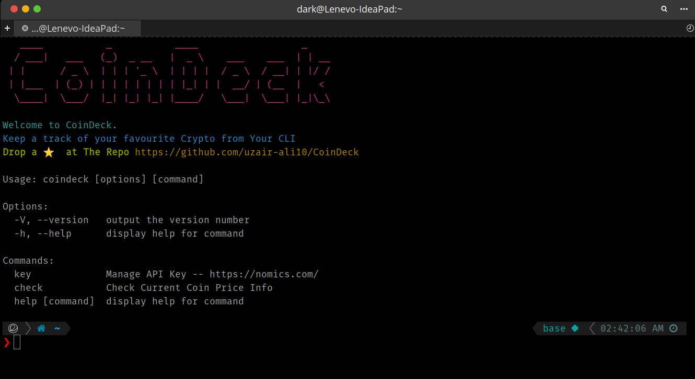
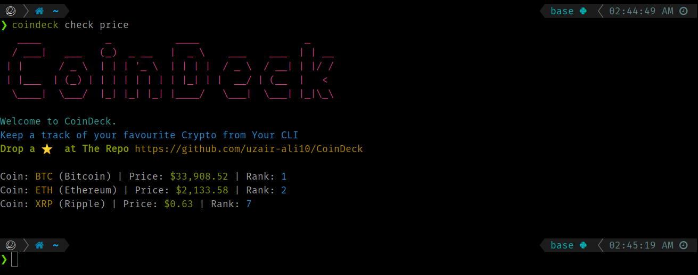
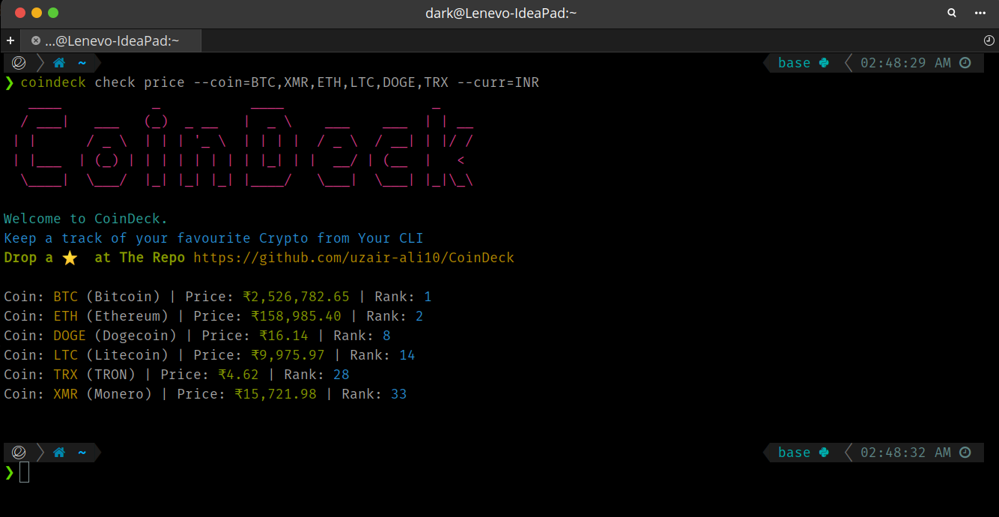

# CoinDeck
[](https://GitHub.com/uzair-ali10/)
[](https://GitHub.com/uzair-ali10/)


Keep a track of your favourite Crypto from Your CLI


    
## Installation

Install CoinDeck with npm

```bash
  npm install
  npm link
```
## API Key
**Get API key from** [https://p.nomics.com/cryptocurrency-bitcoin-api](https://p.nomics.com/cryptocurrency-bitcoin-api)


  
## Screenshots



  
## Commands

#### Key

```bash
  coindeck key
```

| Command |  Description                |
| :-------- | :------------------------- |
| `coindeck key set` |  **Required** Your API key |
| `coindeck key view`|  View The Current API Key in Use |
| `coindeck key delete` |  Delete The Current API Key in Use|

#### Check Price

```bash
  coindeck check
```

| Parameter | image     | Description                |
| :-------- | :------- | :------------------------- |
| `coindeck check price` |  | Fetches the price and rank of coins, default Values are BTC, ETH, XRP, and USD as Currency |
| `coindeck check price --coin=BTC,XMR,ETH,LTC,DOGE,TRX --curr=INR` |  | Fetches details of the specified coins in the Currency specified |

  

  
## Authors

- [@uzair-ali10](https://www.github.com/uzair-ali10)

  
## License

[MIT](https://choosealicense.com/licenses/mit/)


**Supports All the crypto You Love**


**And Many More**